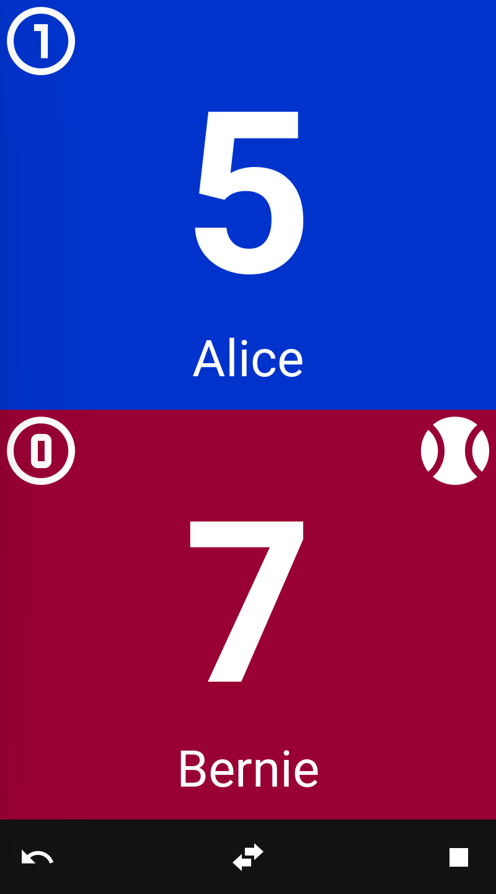
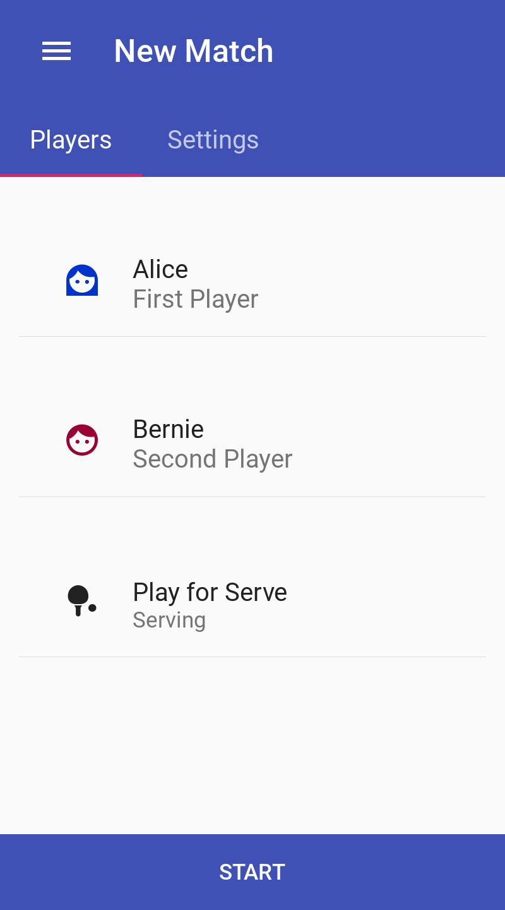
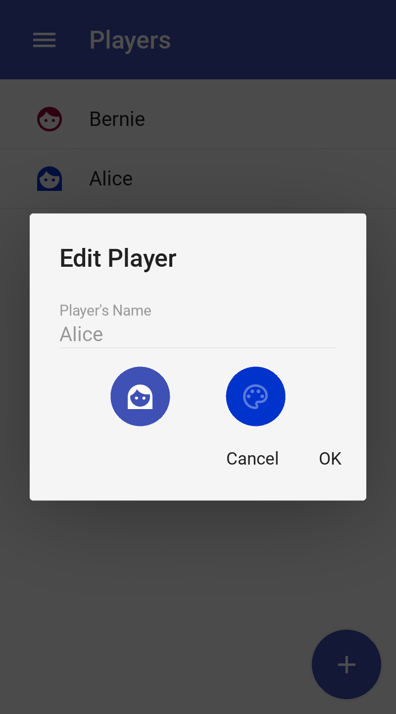
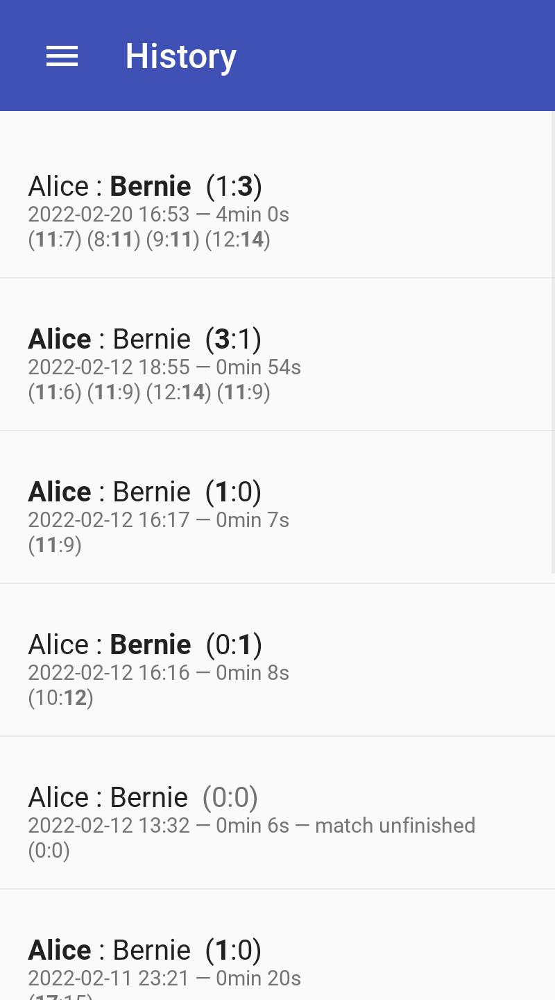
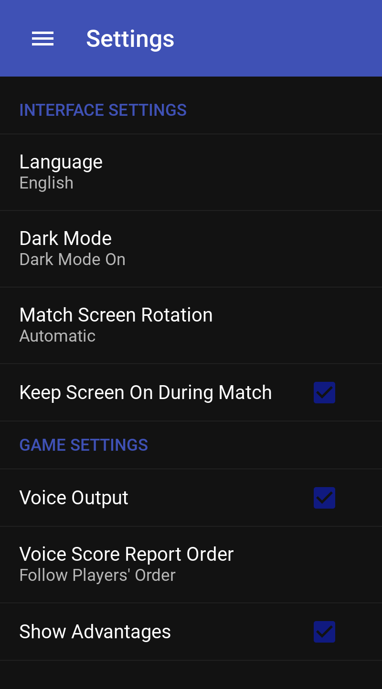
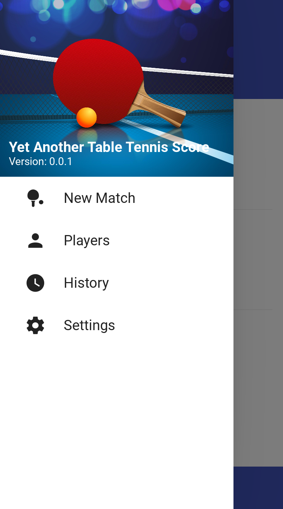
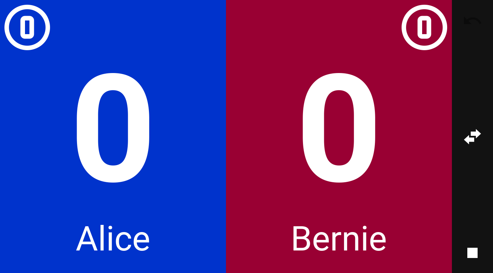

# Yet Another 🏓 Score

## Description

<!-- 

 -->

Yet another scoring app for table tennis. This is designed for amateur play.

### Features

* Define players with custom colors and icons.
* Select number of sets and points per set for each game.
* Big legible score screen; just tap a player area to score a point.
* Serving player tracking.
* Undo butto.
* Easy flip player sides.
* Both horizontal and verical game screen alignment.
* Voice feedback.
* Records games history.

### Screenshots

### Executing program

On desktop simply run `main.py`. On Android... well, just run the app.

## Building

### Dependencies

* Python 3.6 or higher
* [Kivy](https://kivy.org)
* [KivyMD](https://github.com/kivymd/KivyMD)
* [SQL Alchemy](https://sqlalchemy.org/)
* [PyYAML](https://pypi.org/project/PyYAML/)

### Android APK build

In order to build Android package, you can use [Buildozer](https://github.com/kivy/buildozer). Simply type
`buildozer android debug` to build the package. Then connect your phone, activate ADB and type `buildozer android deploy`
to send the package to your phone.

### TODO

* history export
* data backup
* stats screen
* live synchronization with other devices
* bluetooth gearware connection for easy scoring

## Author

Maciej Dems <macdems@gmail.com>

## License

This project is licensed under the GPL3 License - see the [LICENSE.md](LICENSE.md) file for details

## Acknowledgments

Background vector created by [pikisuperstar](https://www.freepik.com/pikisuperstar) - [www.freepik.com](https://www.freepik.com/vectors/background)
